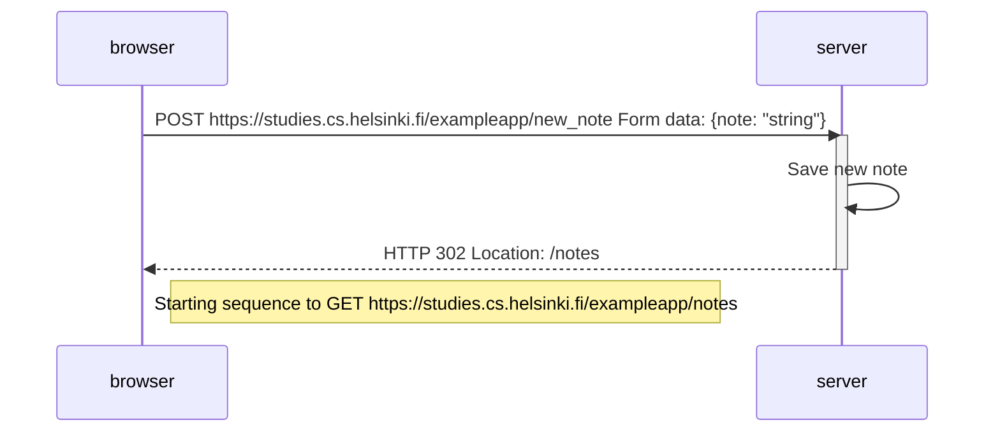

```mermaid
sequenceDiagram
    participant browser
    participant server

    browser->>server: POST https://studies.cs.helsinki.fi/exampleapp/new_note Form data: {note: "string"}
    activate server
    server->>server: Save new note
    server-->>browser: HTTP 302 Location: /notes
    deactivate server

    Note right of browser: Starting sequence to GET https://studies.cs.helsinki.fi/exampleapp/notes
```